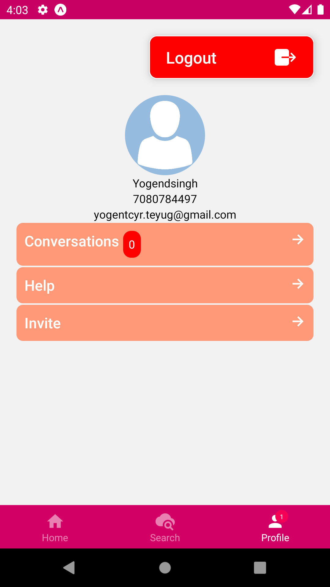

# FinalYearAPP
I am creating a crosspalteform React native (expo) app 
To run/modify this code you need to pull this and make changes
First make sure you have Latest Node LTS installed,
then run npm i command in root directory terminal.
run commands--
npm start 

Here are some screenshots of our app:

  

### Provider List
![Provider List] 

### Provider Showcase

### User Home Screen

### Add Service Screen

### Provider Screen

### Signup Screen

### User Profile Screen

